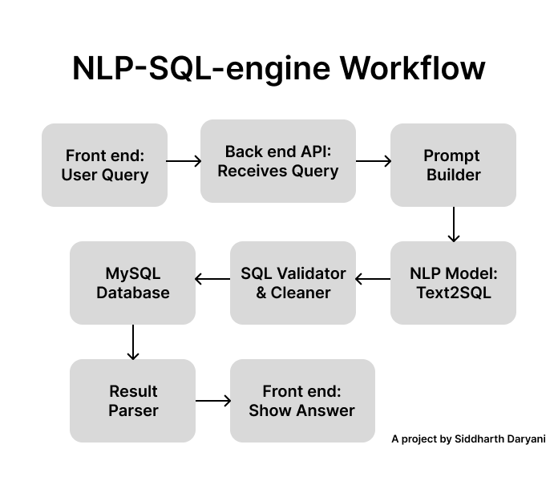

# NLP-SQL-engine

## HOW TO RUN THIS ON YOUR SYSTEM
### Make sure to create a database in your system, use the `SQL-script.sql` to create one.
```console
git clone https://github.com/SiddharthDaryani/NLP-SQL-engine.git
cd NLP-SQL-engine
source init_setup.sh
```

## HERE IS THE WORKFLOW OF MY PROJECT

## Here are key components and technologies used in this project:

### Python: Main programming language for backend logic and integration.

### Flask: Used to create a REST API server that receives natural language queries and returns SQL results.

### Natural Language Processing (NLP): Converts natural language queries to SQL using a transformer-based model.

### Transformers and Tokenizers: Implements models for NLP tasks such as text-to-SQL translation, managed via Python package tools.

### MySQL: Database that stores table data and executes the generated SQL queries.

### HTML/JavaScript Frontend: Provides a user interface to enter questions and display results using AJAX/fetch for real-time responses.

### Prompt Engineering: Constructs input prompts to maximize text-to-SQL model accuracy and reliability.

### Python Package Management: Ensures environment consistency and resolves dependency issues, especially for machine learning libraries.

### Error Handling & Debugging: Includes routines for troubleshooting SQL syntax, dependency conflicts, and API errors.